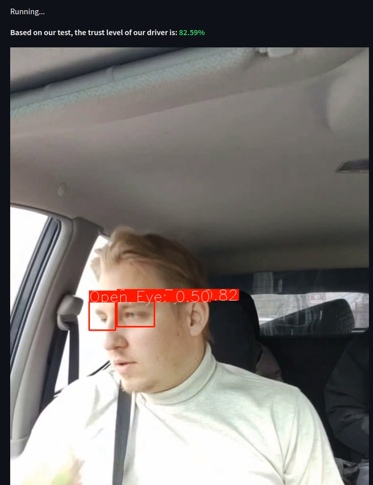

# Good Driver Detector using YOLOV8 

## Overview
This project focuses on YOLO (You Only Look Once) model to detect good and bad habits of driver. The YOLO architecture is a popular object detection algorithm that uses a single neural network to predict bounding boxes and class probabilities directly from full images in real-time.

## Data
To train the YOLO model for driver habits detection you will need a 
labeled dataset of images containing driver's photo. The dataset should include images with bounding box annotations around each driver's detail that we want to focus on(e.g., "Open eye", "Closed eye", "Phone" etc.). It is essential to have a diverse and representative dataset for optimal model performance. I used this [dataset](https://www.kaggle.com/datasets/habbas11/dms-driver-monitoring-system).

## Model Architecture
The YOLO model architecture used in this project is based on the YOLOv8 (You Only Look Once) variant. YOLOv8 is a widely adopted version of the YOLO algorithm known for its accuracy and efficiency.

The YOLOv8 architecture consists of a backbone network (such as Darknet-53) for feature extraction, followed by several detection layers that predict bounding boxes and class probabilities at different scales. The model leverages anchor boxes and multi-scale predictions to detect objects of various sizes.
## Training 
1. Data Preparation: Preprocess your dataset by resizing the images to a consistent input size and converting the annotations to YOLO format. The YOLO format requires bounding box annotations to be represented as normalized coordinates (center_x, center_y, width, height) relative to the image dimensions.

2. Model Configuration: Configure the YOLO model architecture and adjust hyperparameters based on your specific requirements. This includes setting the number of classes, anchor box sizes, training batch size, learning rate, and other related parameters.

3. Training Process: Train the YOLO model on your labeled dataset. During training, the model learns to predict bounding box coordinates and class probabilities. The training process typically involves optimizing a loss function that combines localization loss and classification loss. For training model i used this command:
```bash
python run train.py
```
where you can change every hyperparameter for your needs. 
## Features
The main feature of this application is detecting eyes state, phone cigarette and computing the driver's trust level based on their behavior behind the wheel during the ride. \
Our safety standarts is:
* Most of the time driver has both opened eyes
* There is no phone in hand

The metric I used to calculate is: 
$$T = max(0, (1-\frac{P*10}{L} - \frac{L-O}{L})*100)$$ 
Where: 
* <b>T</b> - trust level of driver
* <b>L</b> - length of video in frames 
* <b>P</b> - count of frames with phone 
* <b>O</b> - count of frames with open eyes 
* 10 near P is standing for weight - it's impermissible if driver is holding and using phone in hand during ride, so the penalty is higher.
* Max function used for specific situation, when the only thing on frames will be just phone, so the trust level won't be negative. Indeed, this situation is not practical, so if our trust level is equal to zero, this is an indicator that there are technical problems with video. \
This GIF represents some part of trip and how detector works:

The output trust level of this driver during whole 6 minutes ride is <b>82.59%</b>, which we consider as high score.

### Problems
* The data, that was used for training is only partly covering full opportunities of this model. If it was containing only photos of drivers, then it would significantly increase perfomance of model.
* When driver waits on traffic light it's not necessary for him to contol road, so he can use phone, drink water etc. For the real world application it will be necessary to use speed sensor for controling penalties.
* Data doesn't contain any drivers with glasses on, so if driver uses sunglasses - it will significantly decrease trust level due to poor perfomance of model.

## Usage
To use the trained model for Good Driver Detector, follow the instructions below:
1. First clone the repository. To do this, open a terminal, go to the directory where you want to clone the project and then enter the command:
```bash
git clone https://github.com/Strongich/GDD_yolo.git
```
2. Go to folder with project and install virtualenv, write the following command and press Enter:
```bash
pip install virtualenv
```
### Or simply run this command:
```bash
docker-compose up -d
```
### And your next step will be 7, you are ready to go!

3. Next create a new environment, write the following command and press Enter:
```bash
virtualenv name_of_the_new_env
```
### Example:
```bash
virtualenv gddyolo
```
4. Next activate the new environment, write the following command and press Enter:
```bash
name_of_the_new_env\Scripts\activate
```
### Example:
```bash
gddyolo\Scripts\activate
```
5. Write the following command and press Enter:
 ```bash
pip install -r requirements.txt
```
6. To launch the backend for model, open folder with project and write the following command and press Enter:
```bash
python src/inference.py
```
6. To launch the frontend for model, open folder with project and write the following command and press Enter:
```bash
streamlit run src/ui.py
```
7. Open this link in your browser [http://localhost:8501](http://localhost:8501) and you free to go!

## Results
The performance of the YOLO model can be measured using metrics like mean average precision (mAP), precision, recall, and intersection over union (IoU). These metrics provide insights into the model's accuracy and detection capabilities.

I've used:
1. 15 epochs with AdamW optimizer, learning_rate = 0.01, batch_size = 16, momentum=0.93 and light augmentation.
2. 30 epochs with AdamW optimizer, learning_rate = 0.01, batch_size = 16, momentum=0.93 and some significant augmentation.
In total 45 epochs.
As far as our main focus was on only "Open Eye", "Closed Eye", "Phone", the overall accuracy is not as interesting, as this 3 classes. We got f1-scores:
* 0.94 for "Open Eye"
* 0.73 for "Clossed Eye"
* 0.81 for "Phone"

You can see more about the metrics and losses in the file <b>./runs/detect/train/results.csv</b> or <b>confusion_matrix_normalized.png</b>.

## Conclusion
In this project, we trained a custom YOLO model for identifying how safe driver rides. By following the steps outlined above, you can create your own good driver detection system using YOLO. Remember to use a diverse and representative dataset, appropriately configure the model, and evaluate its performance to achieve accurate and reliable results.

Please refer to the project documentation and code for detailed implementation instructions and examples. Happy detecting!

## Author
This YOLO Good Driver Detector was developed by Vitenko Igor. If you have any questions or need further assistance, please contact igor.vitenko13@gmail.com.

